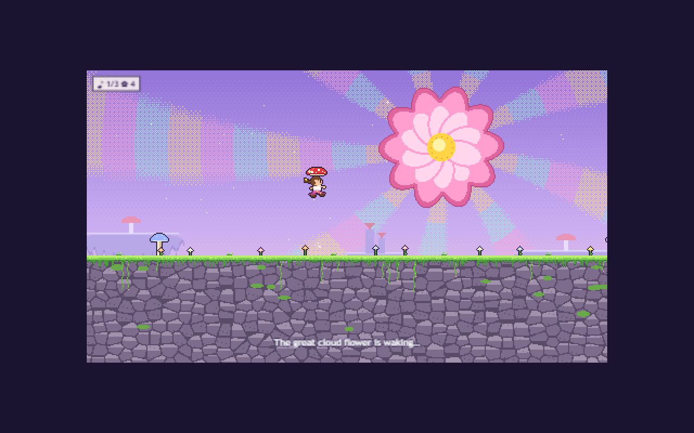

# Cloudbloom: A Sky Out of Tune

*Working title.* A single-player, left-to-right momentum platformer built with TypeScript, Vite and Three.js. **Momentum makes the world bloom.**

The sky has forgotten its morning song. Choose **Poppy** or **Sir Puddlewick** and carry the missing melody across the clouds to the sleeping sun.



## Run it

Requires Node.js 20.19+ or 22.12+ (developed on Node 24).

```sh
npm ci          # install the pinned dependencies from the lockfile
npm run dev     # start a dev server (http://localhost:5173)
npm test        # run the test suites (Vitest)
npm run build   # type-check and build a static site into dist/
npm run preview # serve the built site locally
```

The build output in `dist/` is a fully static site: no backend, no keys. Host it on any static file host; it uses relative asset paths so it can live in a subfolder.

## Controls (keyboard)

| Action | Keys |
| --- | --- |
| Move | `A` / `D` or `←` / `→` |
| Jump (hold for higher) | `Space` |
| Air dash | Double-tap a direction while airborne, or `Shift` (remappable) |
| Pause | `Esc` or `P` |
| Retry from checkpoint | `R` |
| Restart the full run | `Backspace` |
| Mute | `M` |

Menus work with the arrow keys plus `Enter`, or with the mouse.

## What's in the slice

- A start screen, then mode (Adventure / Time Trial), presentation preset (Gentle / Standard / Vivid) and an optional timing assist.
- Character select. Both characters move identically and have identical hitboxes.
- One hand-authored level, *The Morning That Forgot to Happen*, with:
  - a normal route and optional upper express routes
  - recovery clouds
  - three melody fragments on the main route
  - three optional keepsakes
  - six checkpoints
  - the Petal Parade transformation at the midpoint
  - an ending beside the sleeping sun
- Local Time Trial records with splits, versioned by level, movement rules and assist mode.
- A procedural demo score in four adaptive stems, plus sound effects, volume controls and mute.
- Comfort settings: camera shake, afterimages, background distortion and the double-tap window.

See **[docs/STATUS.md](docs/STATUS.md)** for exactly what is complete, what is a placeholder, which tests were run, and measured performance.

### Momentum movement build

The movement overhaul conserves dash/wind speed, buffers dash commands for 100 ms,
supports immediate cloud-skimming rebounds, and separates Time Trial split gates
from respawn flowers. Level 1 receivers and spring forks are measured with the
production physics. See [the movement handoff and playtest checklist](docs/MOVEMENT.md)
and [continuous route evidence](docs/ROUTES.md).

For the eight-section developer playground, run `npm run dev` and open
`http://localhost:5173/?playground`. It has velocity/timer telemetry, section
resets, fixed-step input recording/replay and trajectory comparison. It is
excluded from production builds and Time Trial records.

## Project layout

```
src/
  config/      movement.ts (tuning), animation.ts, audio.ts (score data), presentation.ts (presets), keys.ts
  core/        FixedLoop.ts — 60 Hz fixed-step accumulator
  input/       Input.ts — keyboard → per-step intent, double-tap rules
  sim/         Player.ts (controller), collision.ts (swept AABB), World.ts (level state), Bloom.ts, Parade.ts
  level/       level1.ts (editable level data), types.ts, validate.ts (reachability checks using the real controller)
  render/      GameRenderer.ts (Three.js), CameraRig.ts, characters.ts / props.ts / background.ts (procedural pixel art), Particles.ts
  audio/       AudioEngine.ts — Web Audio scheduler, stems, effects
  ui/          UI.ts + styles.css — DOM menus and HUD over the game view
  persist/     records.ts, settings.ts — localStorage
  game/        Game.ts — wires everything together
tests/         Vitest suites (controller, input, world rules, records, level reachability)
docs/          STATUS.md, ASSETS.md, AUDIO.md, screenshots/
```

### Editing

- **Movement:** change values in `src/config/movement.ts`. If the change affects run times, bump `MOVEMENT_RULES_VERSION` so old records aren't compared with new ones.
- **Level:** edit `src/level/level1.ts`. Every `link(...)` is replayed with the real controller and reports viable sampled takeoff windows. `tests/traversal.test.ts` also replays connected comfort/flow/express routes with carried velocity, refills, hazards and the actual Parade reveal.
- **Art:** all sprites are drawn in code in `src/render/characters.ts` and `src/render/props.ts`. To view every character frame at 4×, open `/?sheet` on the dev server.
- **Music:** see [docs/AUDIO.md](docs/AUDIO.md).

Created in [T3 Code](https://t3.codes).
